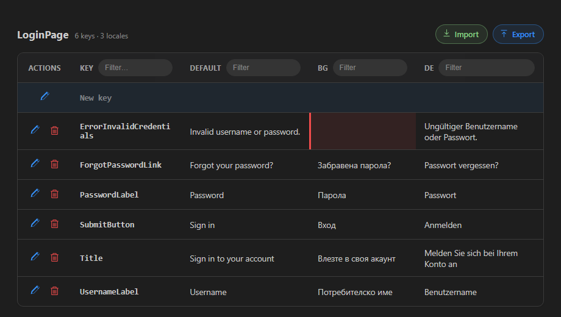
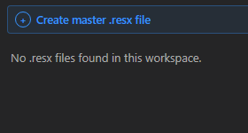
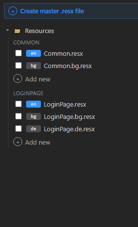

# ResXLocalizer

<br clear="left" />

[](https://marketplace.visualstudio.com/items?itemName=HowBizarre.resxlocalizer)
[](LICENSE)

🇧🇬 Български | [🇬🇧 English](README.md)

Разширение за Visual Studio Code, което показва `.resx` файловете за локализация (същите, които ползва Visual Studio за `.NET` проекти) като една удобна таблица: **ключ + по една колона за всеки език**, вместо да отваряш и сравняваш ръчно по няколко XML файла.



---

## Съдържание

- [Какво прави разширението](#какво-прави-разширението)
- [Инсталация](#инсталация)
- [Първи стъпки](#първи-стъпки)
- [Странична лента — списък с файлове](#странична-лента--списък-с-файлове)
- [Таблица с преводи](#таблица-с-преводи)
- [Експортиране и импортиране](#експортиране-и-импортиране)
- [Как се групират файловете](#как-се-групират-файловете)
- [За преводачи (без програмистки опит)](#за-преводачи-без-програмистки-опит)
- [За C# / Visual Studio разработчици](#за-c--visual-studio-разработчици)
- [Разработка на самото разширение](#разработка-на-самото-разширение)
- [Roadmap](#roadmap)
- [Лиценз](#лиценз)

---

## Какво прави разширението

- **Визуализира всички `.resx` файлове от един "семейство"** (напр. `Strings.resx`, `Strings.bg.resx`, `Strings.de.resx`) като **една таблица**: ред за всеки ключ, колона за всеки език.
- **Редактиране на място** — правиш промени директно в таблицата, разширението ги записва обратно в правилните `.resx` файлове, **запазвайки коментарите и форматирането** им (не пренаписва целия файл).
- **Добавяне на нов превод (нов ключ)** — чрез постоянен ред "New key" най-отгоре на таблицата.
- **Изтриване на ключ** от всички езици наведнъж, с потвърждение преди изтриване.
- **Оцветява липсващите/непреведени стойности в червено**, за да се виждат веднага кои преводи липсват.
- **Филтриране по колона** (по ключ или по стойност на превод), филтрите се комбинират — виждаш само редовете, отговарящи на всички едновременно.
- **Експорт на таблицата в CSV или JSON**, и **импорт** на преводи обратно от CSV/JSON файл — с валидация преди запис и log за преглед, ако е презаписал съществуващи стойности.
- **Странична лента (sidebar)** в Activity Bar с дърво от всички `.resx` файлове в проекта, групирани по папка и по "семейство" — маркираш чрез чекбокс кои файлове искаш да отвориш в таблица.
- **Добавяне на нов език** към съществуващо семейство от файлове директно от страничната лента — избираш от списък с общи езици или въвеждаш произволен код (напр. `pt-BR`); новият файл се създава автоматично с всички ключове от базовия (default) файл, готови за превод.
- **Създаване на нов "master" `.resx` файл от нулата**, ако проектът все още няма нито един.
- **Автоматично разпознаване на базовия език** (напр. "en") от `.csproj`/`.vbproj` (`<NeutralLanguage>`) или `AssemblyInfo` (`NeutralResourcesLanguage`) — същите настройки, които вече ползва .NET проектът ти.
- **Автоматично обновяване** — ако файл бъде променен, добавен или изтрит на диска (например при `git pull` или редакция в друг редактор), таблицата и страничната лента се опресняват сами.
- Всяко "семейство" от `.resx` файлове се отваря в **собствен таб**, за да не се смесват различни таблици.

---

## Инсталация

### Вариант А — от Marketplace (препоръчано)

Търси **"ResXLocalizer"** в панела Extensions (`Ctrl+Shift+X`) във VS Code, или инсталирай директно от [страницата му в Marketplace](https://marketplace.visualstudio.com/items?itemName=HowBizarre.resxlocalizer).

### Вариант Б — от `.vsix` файл

Полезно, ако някой ти е дал конкретен build директно (напр. pre-release версия), вместо през Marketplace.

1. Изтегли файла `resxlocalizer-X.X.X.vsix` (X.X.X е версията).
2. Отвори **Visual Studio Code**.
3. В лявата лента с икони (**Activity Bar**) отвори **Extensions** (иконата прилича на 4 квадратчета ▦), или натисни `Ctrl+Shift+X`.
4. Горе вдясно в панела Extensions натисни бутона с трите точки **`...`**.
5. Избери **"Install from VSIX..."**.
6. Посочи изтегления `.vsix` файл и потвърди.
7. Когато инсталацията приключи, VS Code ще предложи **Reload** (или "Restart Extensions") — натисни го.

Или през терминала:

```bash
code --install-extension resxlocalizer-0.0.1.vsix
```

> **Съвет:** ако по-късно инсталираш нова версия на разширението върху стара, винаги прави **Reload Window** (`Ctrl+Shift+P` → "Developer: Reload Window") — иначе VS Code може да продължи да показва старата версия на вече отворените панели.

---

## Първи стъпки

1. **Отвори работната папка (workspace)** на .NET проекта: **File → Open Folder...** и избери главната папка на проекта (тази, която съдържа `.csproj` файла).
2. В **Activity Bar** (лентата с икони вляво) ще се появи нова икона на разширението — **ResXLocalizer**. Кликни върху нея, за да отвориш страничния панел.
3. Разширението автоматично претърсва цялата папка за `.resx` файлове:

   - **Ако вече има `.resx` файлове** — ще видиш дърво с папки и файлове (виж следващия раздел).
   - **Ако все още няма нито един** — ще видиш само едно съобщение и бутон:

     

     Натискането на **"Create master .resx file"** те превежда през два лесни стъпки: избираш папка, после въвеждаш име (например `Strings`) — разширението създава празен, валиден `.resx` файл (същата структура, която генерира и Visual Studio), готов за първите ти ключове.

4. Маркирай чекбокс до файловете, които искаш да видиш в таблица (виж по-долу), или кликни с десен бутон върху `.resx` файл в обикновения VS Code Explorer → **"ResXLocalizer: Open Resx Table"**.

---

## Странична лента — списък с файлове



Файловете са организирани в дърво:

- **Папка** (📁) — както е в реалната файлова структура на проекта.
- **Семейство** (напр. `LOGINPAGE`) — всички `.resx` файлове с еднакво базово име в тази папка: базовият (default) файл + вариантите му за всеки език.
- Всеки файл има цветно **badge** с езиковия код:
  - **синьо badge** = базовият ("master") файл — този без езиков код в името (`LoginPage.resx`). Ако проектът декларира `<NeutralLanguage>` в `.csproj`, badge-ът ще показва точно този език (напр. `en`) вместо генеричното "src".
  - **сиво badge** = конкретен превод (`bg`, `de`, `fr`...).

**Маркиране на чекбокс отваря таблицата** с избраните файлове (или ги добавя към вече отворената таблица за това семейство). Ако маркираш само превод (напр. `bg`), базовият файл автоматично се маркира и той — таблицата винаги показва поне колоната по подразбиране, за контекст на превода.

**"Add new"** под всяко семейство добавя нов език към него:

1. Клик върху **"+ Add new"**.
2. Появява се списък с най-често срещаните езици (English, Bulgarian, German, French...) — избираш с мишка/стрелки, или **пишеш свой код** (напр. `pt-BR`, `zh-Hant`), ако го няма в списъка.
3. Разширението създава нов `.resx` файл (напр. `LoginPage.pt-BR.resx`) с **всички ключове от базовия файл, но с празни стойности** — готов за превод.
4. Ако другите файлове в семейството вече ползват формат с регион (напр. `de-DE` вместо просто `de`), новият файл автоматично приема същия формат, за консистентност.

Бутонът **⟳ (Refresh)** горе в панела презарежда списъка ръчно (обикновено не е нужен — разширението следи файловете автоматично).

---

## Таблица с преводи

Всяко семейство `.resx` файлове се отваря в собствен таб с таблица:

| Колона | Съдържание |
|---|---|
| **Actions** | Бутони за редакция/изтриване на реда |
| **Key** | Името на ключа (същото за всички езици) |
| **Default** / език | По една колона за всеки `.resx` файл в семейството |

### Редактиране на превод

1. Натисни **✏️ синьото моливче** в началото на реда → клетките на реда стават редактируеми, а иконата се сменя на **💾 зелена дискета**.
2. Промени текста в която и да е клетка (директно, като в обикновен текстов документ).
3. Натисни отново зелената иконка, за да **запазиш**. Стойностите се записват във всеки съответен `.resx` файл — коментарите и форматирането на файла се запазват непокътнати, сменя се само стойността.

### Изтриване на ключ

Натисни **🗑️ червената кофа за боклук** до реда → ще се появи диалог за потвърждение → при потвърждение ключът се премахва от **всички** езикови файлове на реда.

### Добавяне на нов ключ

Най-отгоре на таблицата винаги стои специален ред **"New key"**:

1. Натисни моливчето му, за да го направиш редактируем.
2. Въведи име на ключа в първата клетка и стойностите за всеки език.
3. Натисни save. Ако полето за ключ е празно, се маркира в червено и записът се отказва. Ако въведеният ключ вече съществува в групата, ще бъдеш попитан дали да презапишеш стойността му.

### Липсващи преводи

Клетка без стойност (или само с празни интервали) се откроява с **червен акцент** отляво — веднага виждаш кои езикови варианти още чакат превод.

### Филтриране

Под всяко заглавие на колона (освен Actions) има поле **Filter...** — пишеш текст и се показват само редовете, чиято стойност в тази колона го съдържа (без значение на главни/малки букви). Филтрите на различни колони се комбинират — например филтър `Login` в Key + `грешка` в BG показва само редове, отговарящи на **и двете** условия едновременно.

---

## Експортиране и импортиране

Над всяка таблица, горе вдясно, стоят два бутона: **⬇ Export** и **⬆ Import**.

### Export

Натисни **Export**, избери **CSV** или **JSON**, после посочи къде да се запази файлът. Файлът съдържа по един ред за всеки ключ, с колона за всеки език (колоната на базовия файл се казва `default`) — същата структура, която виждаш и в таблицата.

### Import

Натисни **Import** и посочи `.csv` или `.json` файл. Преди да се запише каквото и да е в `.resx` файловете, разширението валидира файла:

- файлът трябва да се разчете коректно (валиден CSV/JSON), с колона/поле `Key` на всеки ред;
- ако някой ред е неправилен или без ключ, импортът се **отхвърля напълно** — появява се диалог със списък от проблемите, без да е променено нищо.

След успешна валидация:

- редове с **ключ, който още не съществува**, се добавят като нови преводи;
- редове с **ключ, който вече съществува**, презаписват съществуващата стойност за този език — това се записва в log;
- празните клетки се пропускат (никога не изтриват съществуващ превод);
- колони, които не съвпадат с никой от езиковите файлове в тази таблица, се игнорират.

Ако по време на импорта са презаписани съществуващи стойности, автоматично се отваря **нов таб** веднага след приключването, в който са изредени всички презаписани ключове със старата и новата им стойност едно до друго, за преглед какво точно се е променило.

---

## Как се групират файловете

Разширението разпознава файловете по конвенцията на .NET за именуване на ресурси:

- `Strings.resx` — базов ("neutral") файл → показва се като колона по подразбиране.
- `Strings.bg.resx` — вариант за български.
- `Strings.de-DE.resx` — вариант за немски (Германия) с регион.

Всички файлове с еднакво базово име (`Strings`) в една и съща папка образуват едно "семейство" и се показват заедно в една таблица. Ключовете в таблицата са обединението на ключовете от всички файлове в групата — така веднага личи ако даден ключ съществува само в част от езиците.

---

## За преводачи (без програмистки опит)

Ако задачата ти е **само да превеждаш текстове**, не се притеснявай от нищо друго в тази документация — трябват ти само тези стъпки:

1. Отвори проекта в VS Code (някой програмист от екипа ти го е подготвил и ти е дал линк/папка).
2. Кликни иконата **ResXLocalizer** в лявата лента.
3. Маркирай чекбокса до твоя език (например `bg`) в списъка — ще се отвори таблица.
4. Намери редовете с **червено** — това са липсващите преводи.
5. За всеки ред: натисни **моливчето** ✏️, попълни превода в твоята колона, натисни **дискетата** 💾 (тя ще стане зелена, докато редактираш).
6. Готово — промяната се записва автоматично във файла. Не е нужно нищо друго (нито "Save As", нито конзола).

**Не се налага** да пипаш колоната **Key** на съществуващи редове, нито да трием файлове — просто попълвай стойностите в своята колона.

---

## За C# / Visual Studio разработчици

Ако идваш от **Visual Studio** и за пръв път ползваш VS Code само заради това разширение, ето бърз "речник" между двете среди:

| Visual Studio | VS Code + ResXLocalizer |
|---|---|
| **Solution Explorer** | **Explorer** панел (иконка на файлове горе вляво) |
| Двоен клик върху `.resx` → вграден Resource Designer | Десен клик върху `.resx` → **"ResXLocalizer: Open Resx Table"**, или чекбокс в страничния панел на разширението |
| Добавяне на нов `.resx` за нов език ръчно (copy/paste + преименуване) | Бутон **"Add new"** в страничния панел — създава файла и попълва всички ключове автоматично |
| `<NeutralLanguage>` в `.csproj` | Разпознава се автоматично и се показва като badge на базовия файл |

Важно за спокойствие: разширението **не пипа проекта, референциите или `.csproj`** — само чете и записва самите `.resx` файлове, като запазва тяхната XML структура (същата, която очаква и `ResXFileCodeGenerator` във Visual Studio). Можеш спокойно да местиш проекта между двете среди — файловете остават напълно съвместими с Visual Studio и след редакция през ResXLocalizer.

Тъй като промените са минимални diff-ове в самия XML (само сменена стойност или добавен `<data>` блок), git diff-овете остават чисти и лесни за преглед в pull request.

---

## Разработка на самото разширение

За тези, които разработват/поддържат самото ResXLocalizer:

- `npm install` — инсталира зависимостите.
- `npm run watch` — esbuild в watch режим (за `F5` дебъгване в Extension Development Host).
- `npm run check-types` — TypeScript проверка без емитване на файлове.
- `npm run lint` — ESLint.
- `npm run package` — production build (извиква се от `vscode:prepublish`).
- `npm run vsix` — пакетира разширението в `.vsix` файл (`@vscode/vsce`).

---

## Roadmap

- Поддръжка на други формати за локализация (`.json`, `.po`, `.arb`, ...)

---

## Лиценз

ResXLocalizer се разпространява под **Creative Commons Attribution-NonCommercial-ShareAlike 4.0 International (CC BY-NC-SA 4.0)**.

Накратко (пълните условия са в [LICENSE](LICENSE)):

- ✅ Можеш свободно да го **ползваш**, да го **променяш/доразвиваш** и да го **споделяш** с други хора — както в оригинален, така и в преработен вид.
- ✅ Единственото изискване е да се посочи първоизточникът (autor + линк към лиценза) и че преработена версия трябва да се разпространява под същия лиценз.
- ❌ **Не** е позволено то (или преработена версия на него) да се **продава**, да се дава **под наем/абонамент**, или по друг начин да се използва с комерсиална цел.

Пълният текст на лиценза (на английски, правно обвързващ): <https://creativecommons.org/licenses/by-nc-sa/4.0/legalcode>
Резюме на български: <https://creativecommons.org/licenses/by-nc-sa/4.0/deed.bg>
