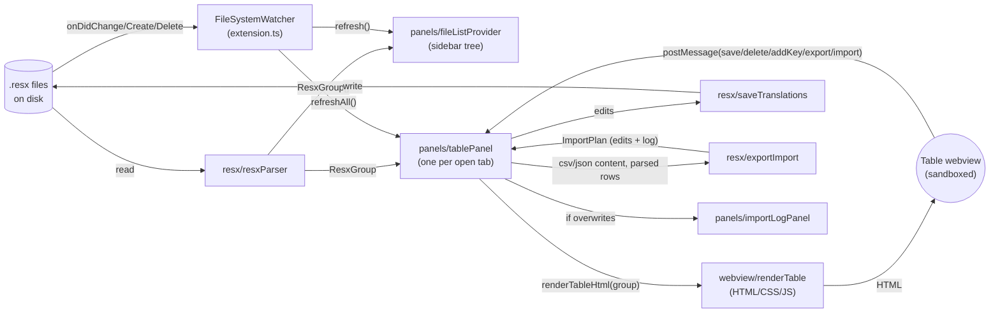

# Architecture

This document is for anyone (human or AI coding agent) making changes to the ResXLocalizer
extension itself. It maps the code, not the features — for a feature/user-facing overview see
[README.md](../README.md).

Every source module also has a short `@module` JSDoc block at the top of the file; this document
is the map that ties them together.

## Folder layout

```
src/
  extension.ts          Activation entry point — commands, file watcher, wiring.

  webview/               Pure HTML/CSS/JS string builders. No `vscode` API calls; these run
                          *inside* the sandboxed webview, not the extension host.
    renderTable.ts        The translation-table webview (the main UI).

  panels/                VS Code-side controllers: own a WebviewPanel/WebviewView, receive its
                          postMessage events, and call into resx/ and locale/ to do the real work.
    tablePanel.ts          One instance per open `.resx` family tab.
    fileListProvider.ts    The sidebar's file tree (Activity Bar view).
    importLogPanel.ts      Read-only "what changed" report after an import with overwrites.

  resx/                  Everything that reads or writes `.resx` files, plus the pure data
                          transforms around them. No webview/HTML code lives here.
    resxParser.ts           Reads `.resx` files from disk -> ResxGroup/ResxFile/ResxEntry.
    saveTranslations.ts     Patches edits back into `.resx` XML in place (keeps comments/formatting).
    resxTemplate.ts         Builds the XML for a brand-new empty `.resx` file.
    createMaster.ts         "Create master .resx file" flow (folder + name prompts -> new file).
    exportImport.ts         CSV/JSON build + parse + validate + import-plan (no I/O — pure functions).

  locale/                Locale-code utilities, independent of any specific `.resx` file.
    locales.ts              Common-languages QuickPick for "Add new" locale.
    localeConvention.ts     Matches a new locale's naming style to its siblings (`de` vs `de-DE`).
    neutralLanguage.ts      Detects a .NET project's declared neutral/master language.

docs/
  ARCHITECTURE.md        This file.
```

## Data flow



Key point: **the webview never touches the filesystem or `vscode` API directly.** It only ever
sends a `postMessage` describing *what happened* (e.g. `{command: "save", edits: [...]}`); the
owning panel class in `panels/` decides whether/how to act on it, and does all the real work by
calling into `resx/`.

## Invariants worth knowing before you change things

- **One `TablePanel` per `dir::baseName`.** `TablePanel.update(group)` always stores the group as
  `currentGroup` — export/import read from that, not from re-parsing the webview's DOM.
- **`saveTranslations` patches XML in place** with targeted regexes instead of re-serializing the
  whole document. This is deliberate: it's what preserves a file's existing `<comment>` blocks and
  formatting. If you need to change how a `<data>` block is written, edit the regex/template there
  rather than swapping in a full XML writer.
- **Webview CSP only allows scripts with the per-render nonce** (`script-src 'nonce-...'`); inline
  `style` is allowed without a nonce (`style-src 'unsafe-inline'`). Any new inline `<script>` you
  add to a webview's HTML must carry that same `nonce` attribute, or the browser silently blocks
  it — this only matters when adding scripts, not styles.
- **`resx/exportImport.ts` has zero `vscode` imports on purpose** — it's the one module that's
  trivially unit-testable in plain Node (see "Verifying changes" below). Keep it that way; do file
  dialogs/reads/writes in `panels/tablePanel.ts` and pass plain strings in.
- **`.vscodeignore` excludes sample/dev-only folders (e.g. `locales/**`) by exact name.** If you
  rename such a folder, update the matching ignore pattern too, or it silently ships inside the
  `.vsix` again.
- **`typescript` is on the native (Go-ported) 7.x compiler, not the classic JS one.** Two
  consequences worth knowing: (1) `tsconfig.json` needs an explicit `"types": ["node"]` — this
  compiler doesn't auto-include every package under `node_modules/@types` the way 5.x did, so
  without it, `Buffer` and friends fail to resolve. (2) `@typescript-eslint` doesn't support TS 7
  yet (its `peerDependencies` cap out at `<6.1.0`), so linting uses `@babel/eslint-parser` +
  `@babel/preset-typescript` instead — a syntax-only TypeScript parser that doesn't care what
  `typescript` version (or even whether "typescript" is installed at all) is in `node_modules`.
  One practical effect: ESLint here is **not type-aware** — `tsc --noEmit` (via `noUnusedLocals`/
  `noUnusedParameters` in `tsconfig.json`) is what now catches unused locals/parameters, not an
  ESLint rule. Keep that split in mind before assuming an ESLint rule would catch a type-level issue.

## Adding a new webview action (e.g. a new button)

1. **`webview/renderTable.ts`** — add the button's markup/CSS/icon, and a `vscode.postMessage({command: "..."})` call in its click handler.
2. **`panels/tablePanel.ts`** — add a branch for that `command` in the constructor's `onDidReceiveMessage` handler, delegating to a new private `handleX()` method.
3. If the action reads/writes `.resx` data, put the actual logic in `resx/` (a pure function if possible) and call it from `handleX()`.
4. Call `await this.refresh()` afterwards if the table's data changed on disk.

## Verifying changes

There's no automated test suite yet. In practice, changes here have been verified with:

- `npm run check-types` and `npm run lint` — must stay clean.
- `npm run vsix` then `code --install-extension resxlocalizer-<version>.vsix --force`, followed by
  a manual **Reload Window** — for anything that needs to be seen running inside real VS Code
  (native dialogs/QuickPicks, the file watcher, actual file I/O).
- For webview HTML/CSS changes specifically: the render functions in `webview/renderTable.ts` and
  the panels' inline HTML builders are plain functions that take data and return a string — they
  can be transpiled standalone (`esbuild --bundle=false`) and rendered with sample `ResxGroup` data
  in a headless browser to check layout/CSS without touching the actual extension host. This is
  how the screenshots in the README were produced.
